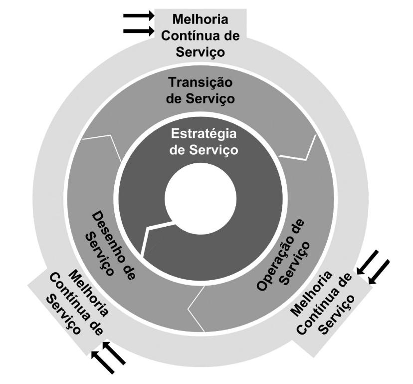

# ITIL V3

## Introdução

Antigamente a área de TI era apenas um setor de apoio para as organizações alcançar seus objetivos de negócio.

ITIL é um framework público que descreve as melhores práticas para gerenciamento de serviços de tecnologia da informação \(TI\). ITIL é um acrônimo de _Information Technology Infrastructure Library_.

Como o próprio nome sugere, a ITIL é uma biblioteca composta por 5 livros, que são eles: **Service Strategy**, **Service Design**, **Service Transition**, **Service Operation** e **Continual Service Improvement**.

A **ITIL** está organizada em 26 processos e 4 funções distribuídos em 5 estágios do ciclo de vida.


✅ Outras definições de ITIL:

* É uma biblioteca composta por um conjunto de 5 livros
* É um padrão aberto que se tornou de domínio público
* É um modelo/abordagem para gestão de serviços de TI
* É um modelo de gestão orientada à processos
* Conjunto de boas práticas de infraestrutura, operação e serviços de TI
* Padrão de boas práticas para gerenciamento de serviços de TI



❌ ITIL não é:

* Não é uma metodologia, nem norma ISO
* Não é uma ferramenta que devemos instalar ou implementar
* Não especifica procedimentos, nem é um passo a passo
* Não é estático, pode ser adaptado para cada organização
* Não é teoria, mas sim baseado em práticas


### Histórico da ITIL

A ITIL foi desenvolvida pelo CCTA _\(Central Computer Telecommunications Agency\)_ no final da década de 80, a partir de uma solicitação do governo britânico, que não estava satisfeito com o nível de qualidade dos serviços a ele prestado.

Em abril de 2001, o CCTA foi incorporado ao OGC _\(Office of Government Commerce\)_, que na época era o órgão responsável evolução da ITIL.

A versão 3 da ITIL foi lançada em maio de 2007 e representou uma grande evolução em relação à versão anterior, por organizar os processos de gerenciamento de serviços em um estrutura de ciclo de vida de serviço.

Em julho de 2011 foi publicada uma atualização da ITIL V3, que ficou conhecida como ITIL v3 2011.

> Antes da popularização da Tecnologia da Informação, não havia necessidade realizar o gerenciamento dos serviços de TI, já que eram esparsos e ocasionais. A partir dos anos 80, os serviços de TI passaram a ocupar um espaço mais relevante nas instituições, fazendo-se necessário um controle mais organizado dos serviços. Neste momento, o governo britânico iniciou a publicação de vários livros, contendo as práticas que ele julgava mais importantes para o gerenciamento dos serviços de TI. Esta coletânea de 40 livros foi denominada **IT Infrastructure Library \(ITIL\)**.

## Conceitos Básicos

### Serviços

De acordo com a ITIL, serviço é um meio de fornecer valor a clientes, facilitando a obtenção de resultados que eles desejam, sem que tenham que arcar com a propriedade de determinados custos e riscos.

> Um **serviço** é um meio de entregar valor aos clientes, facilitando os resultados que os clientes querem alcançar, sem ter que assumir custos e riscos específicos.

### Gerenciamento de Serviços

O ****Gerenciamento de Serviços é um conjunto de capacidades organizacionais \(**processos, métodos de trabalho, funções, papéis e atividades**\) para fornecer valor para o cliente em forma de serviços.


**Definição**: Gerenciamento de Serviços

O ****Gerenciamento de Serviços é um conjunto de **capacidades organizacionais** para fornecer valor para o cliente em forma de serviços.


## Ciclo de Vida do Serviço 

Um serviço nasce, se desenvolve, entra em operação e pode ser descontinuado. É necessário gerenciar o serviço durante todo o seu ciclo de vida, desde a sua concepção até sua retirada de operação.

A ITIL trabalha com o conceito de ciclo de vida do serviço que se traduz em estágios pelos quais o serviço passará desde a sua concepção até seu encerramento.

O ciclo de vida de serviços contém 5 estágios, conforme mostra a figura abaixo.

São características básicas dos 5 estágios do ciclo de vida do serviço:

* **Estratégia de Serviços:** prevê e conceitua um conjunto de serviços que ajuda o negócio alcançar seus objetivos. São tomadas as decisões estratégicas em relação aos serviços que serão desenvolvidos.
* **Desenho de Serviços:** desenha ou projeta os serviços tendo em vista os objetivos de **utilidade** e **garantia**. Basicamente projeta o que a estratégia decidiu e descreve as especificações técnicas para transição de serviço.
* **Transição de Serviço:** move os serviços para o ambiente de produção. Os serviços são desenvolvidos, testados e liberados de forma controlada.
* **Operação de Serviço:** gerencia os serviços em produção para assegurar que sejam alcançados seus objetivos de utilidade e garantia. São os processos do dia a dia que mantém os serviços em funcionamento.
* **Melhoria Contínua de Serviço:** avalia os serviços e identifica formas de melhorar sua utilidade e garantia no suporte aos objetivos de negócio.

## Processos e Funções

Os processos e funções da ITIL encontram-se distribuídos entre os 5 estágios do ciclo de vida, conforme tabela a seguir:

<table>
  <thead>
    <tr>
      <th style="text-align:left">Est&#xE1;gios</th>
      <th style="text-align:left">Processos</th>
      <th style="text-align:left">Fun&#xE7;&#xF5;es</th>
    </tr>
  </thead>
  <tbody>
    <tr>
      <td style="text-align:left"><a href="itil-v3.md#estrategia-de-servicos">Estrat&#xE9;gia de Servi&#xE7;o</a>
      </td>
      <td style="text-align:left">
        <ol>
          <li><a href="itil-v3.md#gerenciamento-de-estrategia-de-servico">Gerenciamento da Estrat&#xE9;gia de Servi&#xE7;os</a>
          </li>
          <li><a href="itil-v3.md#gerenciamento-de-portifolio">Gerenciamento de Portf&#xF3;lio</a>
          </li>
          <li><a href="itil-v3.md#gerenciamento-financeiro">Gerenciamento Financeiro</a>
          </li>
          <li><a href="itil-v3.md#gerenciamento-de-demanda">Gerenciamento de Demanda</a>
          </li>
          <li><a href="itil-v3.md#gerenciamento-de-relacionamento-com-o-negocio">Gerenciamento de Relacionamento com o Neg&#xF3;cio</a>
          </li>
        </ol>
      </td>
      <td style="text-align:left"></td>
    </tr>
    <tr>
      <td style="text-align:left"><a href="itil-v3.md#desenho-de-servico">Desenho de Servi&#xE7;o</a>
      </td>
      <td style="text-align:left">
        <ol>
          <li>Coordena&#xE7;&#xE3;o do Desenho</li>
          <li>Gerenciamento de Cat&#xE1;logo de Servi&#xE7;o</li>
          <li>Gerenciamento de N&#xED;vel de Servi&#xE7;o</li>
          <li>Gerenciamento de Capacidade</li>
          <li>Gerenciamento de Disponibilidade</li>
          <li>Gerenciamento de Continuidade</li>
          <li>Gerenciamento de Seguran&#xE7;a da Informa&#xE7;&#xE3;o</li>
          <li>Gerenciamento de Fornecedores</li>
        </ol>
      </td>
      <td style="text-align:left"></td>
    </tr>
    <tr>
      <td style="text-align:left"><a href="itil-v3.md#transicao-de-servico">Transi&#xE7;&#xE3;o de Servi&#xE7;o</a>
      </td>
      <td style="text-align:left">
        <ol>
          <li>Planejamento e Suporte &#xE0; Transi&#xE7;&#xE3;o</li>
          <li>Gerenciamento de Mudan&#xE7;as</li>
          <li>Gerenciamento de Configura&#xE7;&#xE3;o e Ativos</li>
          <li>Gerenciamento de Libera&#xE7;&#xE3;o e Implata&#xE7;&#xE3;o</li>
          <li>Avalia&#xE7;&#xE3;o de Mudan&#xE7;as</li>
          <li>Valida&#xE7;&#xE3;o e Testes de Servi&#xE7;os</li>
          <li>Gerenciamento do Conhecimento</li>
        </ol>
      </td>
      <td style="text-align:left"></td>
    </tr>
    <tr>
      <td style="text-align:left"><a href="itil-v3.md#operacao-de-servico">Opera&#xE7;&#xE3;o de Servi&#xE7;o</a>
      </td>
      <td style="text-align:left">
        <ol>
          <li>Gerenciamento de Eventos</li>
          <li>Gerenciamento de Incidentes</li>
          <li>Gerenciamento de Problemas</li>
          <li>Cumprimento de Requisi&#xE7;&#xF5;es</li>
          <li>Gerenciamento de Acesso</li>
        </ol>
      </td>
      <td style="text-align:left">
        <ol>
          <li>Central de Servi&#xE7;os</li>
          <li>Gerenciamento T&#xE9;cnico</li>
          <li>Gerenciamento de Aplica&#xE7;&#xF5;es</li>
          <li>Gerenciamento de Opera&#xE7;&#xF5;es de TI</li>
        </ol>
      </td>
    </tr>
    <tr>
      <td style="text-align:left"><a href="itil-v3.md#melhoria-continua-de-servico">Melhoria Cont&#xED;nua de Servi&#xE7;o</a>
      </td>
      <td style="text-align:left">
        <ol>
          <li>Melhoria em 7 passos</li>
        </ol>
      </td>
      <td style="text-align:left"></td>
    </tr>
  </tbody>
</table>## Estratégia de Serviço

Na estratégia de serviços se produz e mantém planos estratégicos.

Nesse estágio, busca-se responder algumas perguntas:

* Quais serviços oferecer e para quem?
* Como se diferenciar dos competidores?
* Como criar valor para os interessados no serviço?
* Como alocar recursos de forma eficiente?

### Os  4 Ps  da estratégia

* **Perspectiva**: define a visão da organização, missão, valores e convicções.
* **Posição**: a imagem que a organização pretende passar para os clientes, ou seja, como o mercado enxerga a organização.
* **Plano**: traduz a estratégia para ações.
* **Padrão**: descreve as características essenciais dos serviços.

### Valor do serviço

É o grau em que as expectativas do cliente são atingidas, e pode ser definido em função de duas variáveis:

* **Utilidade:** capacidade de atender às necessidades dos clientes e de minimizar as suas restrições.
* **Garantia:** está relacionada ao atendimento dos requisitos de disponibilidade, capacidade, continuidade e segurança estabelecido pelos clientes.

### Tipos de provedores de serviço

Os tipos de provedores são classificados em 3 tipos:

1. **Tipo I**: interno e dedicado
2. **Tipo II**: interno e compartilhado
3. **Tipo III:** externo\(terceirizado\)

### Ativos estratégicos

**Recursos** e **habilidades** são considerados ativos de serviço de uma organização e são a base para a criação de valor para o serviço.

* **Habilidades**: aptidão da organização para executar atividades. São ativos intangíveis.
* **Recursos**: Infraestrutura, pessoas, dinheiro ou qualquer outra coisa que possa ajudar na entrega de serviços de TI.

Resumo das habilidades e recursos na tabela a seguir:

| **Habilidades** | **Recursos** |
| :--- | :--- |
| **Pessoas\(intelectual\)** | **Pessoas** |
| Conhecimento | Informações |
| Processos | Aplicações |
| Organização | Infraestrutura |
| Gerenciamento | Capital Financeiro |


🧠**Mnemônico!**

**Pessoas** detém o conhecimento...


### Estilos Organizacionais

* **Rede:**
* **Diretivo:**
* **Delegação:**
* **Coordenação:**
* **Colaboração:**

### Processos

Os processos integrantes da estratégia de serviço são:

#### Gerenciamento da Estratégia de Serviço

#### Gerenciamento de Portfólio

#### Gerenciamento de Demanda

#### Gerenciamento Financeiro

#### Gerenciamento de Relacionamento com o Negócio

## Desenho de Serviço

Este estágio do ciclo de vida tem como foco o desenho e a criação de serviços de TI, cujo propósito será realizar a estratégia concebida no estágio de estratégia de serviço.

No desenho de serviço são feitas as especificações técnicas dos serviços de TI.

### Os 5 aspectos do desenho do serviço

### 4 Ps do desenho

* Pessoas
* Processos
* Produtos
* Parceiros

### Processos

#### Coordenação do Desenho

#### Gerenciamento de Catálogo de Serviço

#### Gerenciamento de Nível de Serviço

> SLA\(Service level agreement\) ou ANS\(Acordo de nível de serviço\) é um acordo **entre o provedor de serviços de TI e um cliente**. O acordo de nível de serviço descreve o serviço de TI, documenta metas de nível de serviço e especifica as responsabilidades do provedor de serviço de TI e do cliente. Um único acordo pode cobrir múltiplos serviços de TI ou múltiplos clientes.

> ANO\(Acordo de nível operacional\) é um acordo entre um **provedor de serviços de TI e outra parta da mesma organização**. Ele dá apoio à entrega, pelo provedor de serviço de TI, de serviços de TI a clientes e define os produtos ou serviços a serem fornecidos e as responsabilidades de ambas as partes.


\*\*\*\*💡**Dica:** veja que a maior diferença entre os dois é o cliente em si. Enquanto no ANS o cliente é externo ao provedor de serviço, no ANO esse cliente é da mesma organização.


#### Gerenciamento de Capacidade

#### Gerenciamento de Disponibilidade

O processo de gerenciamento da disponibilidade visa assegurar que os serviços de TI sejam projetados para atender e preservar os níveis de disponibilidade e confiabilidade requeridos pelo negócio.


✏**Nota:** Definições importantes

* **Disponibilidade:** refere-se a habilidade de um serviço, componente ou item de configuração **desempenhar suas funções acordadas quando necessário**.
* **Confiabilidade:** tempo que um serviço ou componente pode funcionar **sem interrupção** em conformidade com o acordo.
* **Sustentabilidade:** rapidez que um serviço, componente ou item de configuração consegue ser **restaurado** para seu estado normal após uma falha.
* **Serviceability:** é a habilidade de um fornecedor em atender os termos de seu contrato.


#### Gerenciamento de Continuidade

#### Gerenciamento da Segurança da Informação

#### Gerenciamento de Fornecedores

## Transição de Serviço

O estágio de transição do serviço tem como principal objetivo colocar no ambiente de produção, em plena operação, um serviço que acabou de sair do estágio de desenho do serviço.

## Operação de Serviço

Este é o estágio que se preocupa em entregar aos clientes e usuários os níveis de serviço acordados e gerenciar as aplicações, tecnologia e infraestrutura que suportam a entrega do serviço. É nele que os serviços efetivamente entregam **valor** ao cliente.


\*\*\*\*✏**TOME NOTA!** 

É o estágio responsável pelas atividades do dia a dia, orientando sobre como garantir a entrega e o suporte a serviços de forma eficiente e eficaz, detalhando os processos de gerenciamento de **eventos**, **incidentes**, **problemas**, **acesso** e **execução de requisições**.


### Processos

#### Gerenciamento de Eventos

#### Gerenciamento de Incidentes

#### Gerenciamento de Problemas

#### Cumprimento de Requisição

#### Gerenciamento de Acesso

### Funções

#### Central de Serviços

#### Gerenciamento Técnico

#### Gerenciamento de Aplicações

## Melhoria Contínua de Serviço

Em elaboração

## Provas recentes

* TJ/PA
* SEFAZ/DF
* SEFAZ/AL
* SEFAZ/RS
* COGE/CE
* SEFAZ/BA
* SEMEF/MA
* TRF 4

